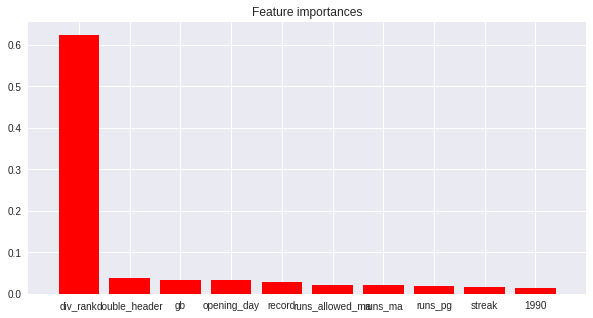
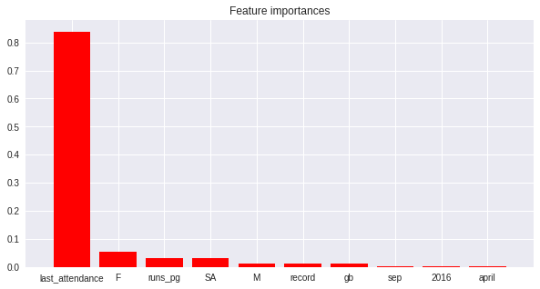
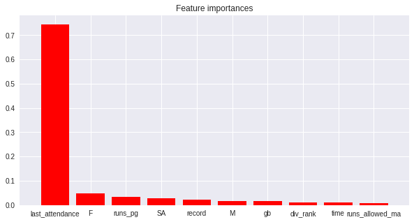
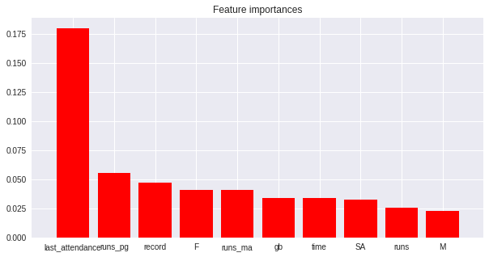
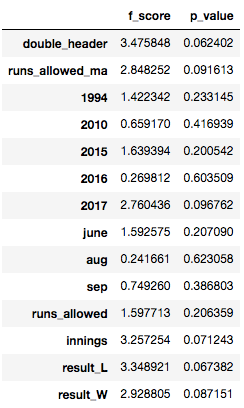

  # Predicting Major League Baseball game attendance

Using game log data from past to predict the attendance of today's game!

## Synopsis

Most of the MLB teams expects tens of thousands of crowd each day. The number fluctuates for teams and each of them have varying trends and seasonality. The venue operates with maximum capacity, have multiple ways of generating revenue through food, beverage, and merchandise. How should teams prepare for their home game? With attendance estimation, can teams maximize the profit? What metrics should be looked at to assess the prediction?

What impacts the audience number for major league baseball? Baseball season experiences 162 games per each team in a span of a little less than 8 months. On top of that, each game requires more than three hours in most cases. Operating venue and events in such scale is non trivial. What better way to prepare for the ball game than predicting the amount of crowd you’d expect today?

Here, we are going to analyze and predict the number of attendance per each team in MLB. What are the factors that drives people to stadium? We are going to take two different approach to tackle this task. Are people more sensitive to the every-day results and game condition? Or are people more reactive to yearly performance that each team put up? Is there sequential effect in attendance number?

### Data Set

Main data set:
  1. Game by game data from 1990 to 2016, includes each game result details (obtained from Troy Harper, GA Alumni from Washington DC, https://github.com/tkh5044/portfolio)
  2. Game by game data for 2017 from baseball-reference.com (example:https://www.baseball-reference.com/teams/LAA/2017-schedule-scores.shtml')
Supplement data set:
  1. Game logs data for 2015 from retrosheet baseball (http://www.retrosheet.org/gamelogs/index.html)

##### Main data set # 1 information:

<table border="1" cellpadding="6">
    <tr>
		<td bgcolor="#DDEEFF"><b>Data Set Characteristics:</b></td>
		<td>Multivariate</td>
		<td bgcolor="#DDEEFF"><b>Number of Instances:</b></td>
		<td>63862</td>
		<td bgcolor="#DDEEFF"><b>Area:</b></td>
		<td>Sports/Entertainment</td>
	</tr>
	<tr>
		<td bgcolor="#DDEEFF"><b>Attribute Characteristics:</b></td>
		<td>Categorical, Integer</td>
		<td bgcolor="#DDEEFF"><b>Number of Attributes:</b></td>
		<td>25</td>
		<td bgcolor="#DDEEFF"><b>Date Obtained</b></td>
		<td>2017-12-01</td>
	</tr>
	<tr>
		<td bgcolor="#DDEEFF"><b>Associated Tasks:</b></td>
		<td>Regression</td>
		<td bgcolor="#DDEEFF"><b>Missing Values?</b></td>
		<td>Yes</td>
		<td bgcolor="#DDEEFF"><b>from:</b></td>
		<td>baseball-reference.com</td>
	</tr>
</table>

##### Main data set # 2 information:

<table border="1" cellpadding="6">
    <tr>
		<td bgcolor="#DDEEFF"><b>Data Set Characteristics:</b></td>
		<td>Multivariate</td>
		<td bgcolor="#DDEEFF"><b>Number of Instances:</b></td>
		<td>81</td>
		<td bgcolor="#DDEEFF"><b>Area:</b></td>
		<td>Sports/Entertainment</td>
	</tr>
	<tr>
		<td bgcolor="#DDEEFF"><b>Attribute Characteristics:</b></td>
		<td>Categorical, Integer</td>
		<td bgcolor="#DDEEFF"><b>Number of Attributes:</b></td>
		<td>35</td>
		<td bgcolor="#DDEEFF"><b>Date Obtained</b></td>
		<td>2017-12-01</td>
	</tr>
	<tr>
		<td bgcolor="#DDEEFF"><b>Associated Tasks:</b></td>
		<td>Regression</td>
		<td bgcolor="#DDEEFF"><b>Missing Values?</b></td>
		<td>Yes</td>
		<td bgcolor="#DDEEFF"><b>from:</b></td>
		<td>baseball-reference.com</td>
	</tr>
</table>

 
### Attribute information. 

- 'Date' : What date the game was played
- 'Box': fixed values of “boxscore”, which signifies this is a boxscore
- 'Team': Home team name in three letter abbreviation
- 'At: city where the team is playing
- 'Opponent': away team 
- 'W_or_l': Game results
- 'runs' : Home team run scored
- 'runs_allowed' : opponent team run scored
- 'innings' : Total innings played
- 'record' : Team record on that date
- 'div_rank' : Division ranking on that date
- 'gb'  : Game differences from division top ranker
- 'Winning_pitcher': Winning pitcher that day
- 'Losing_pitcher': Losing pitcher that day
- 'Save':Save pitcher that day
- 'Time': Total duration of the game
- 'd_or_n':Day or night game status 
- 'attendance' : Number of attendance
- 'streak' : What streak the home team is on that day 
- 'Double_header': boolean, 1 if the game is double header
- 'Runs_pg': runs per game
- 'runs_ma': five game moving average runs	
- 'Runs_allowed_ma': five game moving average opponent runs
- 'ten_game' : recent ten game results in number of wins 
- 'Opening_day' : boolean, 1 if the game was opening day game. 

### Problem Statement

> Definition: A computer program is said to learn from experience `E` with respect to some class of tasks `T` and performance measure `P`, if its performance at tasks in `T`, as measured by `P`, improves with experience `E`.

From Mitchell's *Machine Learning*

Here we will call the known information about the previous date game detail and current time-related categories in this data set to be `E`.

We will define our task `T` to be a regression prediction of today's baseball game attendance. 

We will define a performance metric `P` to be an R-Squared. 

**We seek a regression program that takes in the major league game log data set and is able to predict number of attendance as measured by R-Squared**

### Solution Statement

Innate linearity of baseball statistics lead me to believe that linear models will work well with this data. Logistic Regression and Support Vector Machine with Variance Inflation Factor feature selection and ANOVA testing feature selection will be used. 

In order to assess the data with no feature reduction, will be using non-parametric models Bagging Regressor, Decision Tree Regressor, Random Forest Regressor, and Gradient Boosting Regressor will be used with no transformation. 

### Benchmark

As a benchmark, predict every game attendance to be that same year's mean attendance. We will run R-squared with every game that the prediction was that year's average.

### Performance Metric
- R-squared will be used to assess the effectiveness of prediction. 

### Project Roadmap
**2017 World Series Champion, Houston Astros will be used as an example.**

##### Data Cleaning

1. Features 'at', 'winning_pitcher', 'losing_pitcher','save','ten_game','box' got dropped
   - at: represents either home game or visiting game, only using home games. 
   - winning_pitcher, losing_pitcher, save: using pitchers and dummied them will create too much noise.
   - ten_game: recent ten game average got dropped since streak info and record is included.
   - box: every row was NaN
2. 'Attendance' had nearly 500 NaN values. Upon inspecting, apart from 4 rows, all of NaNs were recorded for double headers. The first double header included the info. Copy and swifted first game of double header and applied to the second game. 4 rows that had no info had issues with data collection or game itself. Upon validating with other datasets (retrosheet), it also had attendance for those days missing. Dropped four rows. 
3. 'innings' had NaNs where they played normal 9.0 inning games. The columns specifies if they had played more or less innings. 
4. 'streak' had one NaN value where it was the opening game. Filled it with 0. 
5. 'w_or_l' had categories where they added extra information to win or lose (i.e. if they went to extra innings), converted them to win, lose, tie and dummied them. 
6. 'record' is win-lose foramt, convert it to winning%
7. 'gb' had 'up + int' format for leading teams and postive int for trailing teams. Make negative value for trailing team.
8. Timestamp 'time' and 'date'
    - time: hr:min format, converted to total minutes played. 
    - date: made categorical columns year, month, weekday and dummied them (kept the original for EDA purposes) 
9. 'Streak' was '+' and '-' format with no scalars,repetition to signify the number of streaks, or both string '0' and integer 0 that meant the same no streaks. Converted it to scalar values and combined both zero columns for no streaks. 
10. 'attendance' is a string with comma within, converted it to scalar.
11. 'd_or_n' dummied them with time as a prefix. 
12. Go through similar steps for scrapped 2017 data.

##### Sample the data into different teams
- The variance and nuances amongst the team and its fan base, geographical characteristics are too varying and will not be useful to predict league as a whole for real-world application. Data will be splitted into teams for these considerations. 

##### More data cleaning

1. Create a team data frame from the whole set
2. The data contained NaNs in first 5 games for 5 day moving average 'runs_ma' column. Create a separate time, run data frame to calculate the 5 game moving average and applied the values.
3. Features 'attendance','runs', 'runs_allowed', 'innings', 'time', 'result_L', 'result_T', 'result_W' shifted to the following home game. 
    - These features are the stats for that game. I want to see how people react to the results of the previous day. Apply these value to the following game implies it is indeed the previous day stats that impacts today's crowd. Filled thes with 0 for opening day games. Renamed attendance to last_attendance and kept original attendance for target feature. 
4. Created list for rival teams and added a bool feature of 'rival' signifying if the team is playing the rival team. 
5. Repeat same steps for 2017 data and combine them. 

##### Exploratory Data Analysis (EDA)
1. Basic Descriptive Statistics with Skewness
2. Boxplot time against attendance
3. Numerical features distribution
4. Categorical feature point plot against attendance
5. Swarmplot plots for month, weekday categorical features
6. Scatter plot of numerical features against attendance
7. Residual plot of numerical features against attendance
8. Heatmaps for numerical features

##### Benchmark & Metric
Naive Benchmark: Every game is that year's average
R Squared: 0.52130332387568956

##### Benchmark Model

Four regression models will be used as a benchmark models. Both raw and scaled data is fitted:

   | model_name | test_score | train_score | scaled_train | scaled_test
   |:-:|:-:|:-:|:-:|:-:|
   | Bagging Regressor | 0.945555 | 0.670562 | 0.942537 | 0.671433
   | Decision Tree Regressor | 1.000000 | 0.487577 | 1.000000 | 0.452631
   | Random Forest Regressor | 0.943169 | 0.691781 | 0.939786 | 0.661827
   | Gradient Boosting Regressor | 0.810025 | 0.706120 | 0.810025 | 0.706511
   
##### Model fitting with GridSearchCV
- Fit the data with optimized parameter for model through GridSearchCV
- Create top ten ranking of feature importances for each model prediction

| model_name | test_score | train_score | scaled_train | scaled_test | P&O_train_score | P&O_test_score
   |:-:|:-:|:-:|:-:|:-:|:-:|:-:|
   | Bagging Regressor | 0.945555 | 0.670562 | 0.942537 | 0.671433 | 0.941767 | 0.682002
   | Decision Tree Regressor | 1.000000 | 0.487577 | 1.000000 | 0.452631 | 0.697863 | 0.602239
   | Random Forest Regressor | 0.943169 | 0.691781 | 0.939786 | 0.661827 | 0.777164 | 0.684849
   | Gradient Boosting Regressor |	0.810025 | 0.706120 | 0.810025 | 0.706511 | 0.829806 | 0.728155

Most of the models indicated that yesterday's attendance number was the biggest factor in making such prediction. There might be a strong sequential factor in attendance number. 

##### Feature Engineering 
1. VIF: 

| VIF |	features |
|:-:|:-:|
|6.251652|	div_rank |
|4.683718|	runs_pg  |
|4.649621|	gb |
|4.349989|	record |

Above features were dropped. 

2. ANOVA Testing:

Above features were dropped

3. Principal Component Analysis 
Both of VIF features and ANOVA testing features went through dimension reduction. 
- By number of component 50, 98% of data is explained in VIF features
- By number of compopent 1, whole data is explained in ANOVA testing features
    
4. Model fitting

| model_name | VIF_train_score |	VIF_test_score | ANOVA_train_score | ANOVA_test_score
|:-:|:-:|:-:|:-:|:-:|
| Logistic_Regression | 1.000000 | 0.002232 | 0.003354 | 0.000000
| Support Vector Machine | 0.752512 |	0.712732 | 0.747672 | 0.721027

5. Conclusion

- Non-parametric model, support vector machine regressor was able to obtain .721 R Squared with feature with ANOVA testing.
- Parametric model, gradient boosting regressor was able to obtain .728 R Squared with no feature selection.

Both models were about the same in the performance metric. 
In a season where games are played day to day, pararmetric model will be able to be more flexible with the data. The model will be re-written with the newly acquired data that machine learns. If we were to use the same model again and again, it would be effecient to make prediction with Gradient Boosting. Moreover, the feature importance is also easily computed with the algorithm. 
With linear models, even though we will not have to suffer in performances right now, as season goes on and more games are played, the type of year to year variances that we can expect to see might not be able to captured. However, it is important to note that since with ANOVA testing feature selection and PCA together condensed down the feature to one principal component, the computation speed for prediction was instant. In a situation where short training time is required, this might serve as a good method to draw predictions. 

## Acknowledgments

* Special thanks to Troy Harper. Not only he provided me the resources and approval to obtain the data, but he also helped me writing codes for scrapping baseball-reference.com
